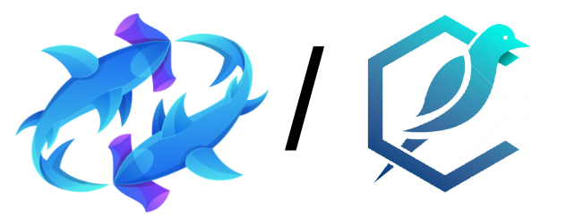

# Poolshark Report

> Copyright © 2023 by Canary Technologies Inc. All rights reserved.
>
> Apr 04, 2023
>
> by **Canary Technologies Inc.**



This report presents our engineering engagement with the Poolshark team on their range-bound liquidity protocol.

| Project Name    | Poolshark                          |
| --------------- | ------------------------------------------------ |
| Repository Link | https://github.com/poolsharks-protocol/range  |
| Commit Hash     |  First: b62dfe3; <br/> Final: 389b640;               |
| Language        | Solidity                                         |
| Chain           | Arbitrum                                         |


## Service Scope

### Service Stages

Our auditing service includes the following two stages:

- Pre-Audit Consulting Service
- Smart Contract Auditing Service

1. **Pre-Audit Consulting Service**
   - [Protocol Security & Design Discussion Meeting]
   As a part of the audit service, the Canary Technologies team worked closely with the Poolshark development team to discuss potential vulnerabilities and smart contract development best practices in a timely fashion. The Canary Technologies team is very appreciative of establishing an efficient and effective communication channel with the Poolshark team, as new findings were exchanged promptly and fixes were deployed quickly, during the preliminary report stage.

2. **Smart Contract Auditing Service**
   The Canary Technologies team analyzed the entire project using a detailed-oriented approach to capture the fundamental logic and suggested improvements to the existing code. Details can be found under **Findings & Improvement Suggestions**.

### Methodology

- Code Assessment
  - We evaluate the overall quality of the code and comments as well as the architecture of the repository.
  - We help the project dev team improve the overall quality of the repository by providing suggestions on refactorization to follow the best practice of Web3 software engineering.
- Code Logic Analysis
  - We dive into the data structures and algorithms in the repository and provide suggestions to improve the data structures and algorithms for the lower time and space complexities.
  - We analyze the hierarchy among multiple modules and the relations among the source code files in the repository and provide suggestions to improve the code architecture with better readability, reusability, and extensibility.
- Business Logic Analysis
  - We study the technical whitepaper and other documents of the project and compare its specification with the functionality implemented in the code for any potential mismatch between them.
  - We analyze the risks and potential vulnerabilities in the business logic and make suggestions to improve the robustness of the project.
- Access Control Analysis
  - We perform a comprehensive assessment of the special roles of the project, including their authority and privileges.
  - We provide suggestions regarding the best practice of privilege role management according to the standard operating procedures (SOP).
- Off-Chain Components Analysis
  - We analyze the off-chain modules that are interacting with the on-chain functionalities and provide suggestions according to the SOP.
  - We conduct a comprehensive investigation for potential risks and hacks that may happen on the off-chain components and provide suggestions for patches.
 
### Audit Scope

Our auditing for Poolshark covered the repository:

- https://github.com/poolsharks-protocol/range: commit hash **[b62dfe37c372fe5847d2ab27f2782003b15a8658](https://github.com/poolsharks-protocol/range/tree/b62dfe37c372fe5847d2ab27f2782003b15a8658)**

## Project Summary

Poolshark Range pool is a concentrated liquidity pool supporting both fungible and non-fungible positions. Non-fungible positions uses ERC20 as position tokens which can be transferred and traded.

Architecture diagram:


## Findings & Improvement Suggestions

|Severity|**Total**|**Acknowledged**|**Resolved**|
|---|---|---|---|
|<span class="color-high">**High**</span>|8|3|3|
|<span class="color-medium">**Medium**</span>|4|2|2|
|<span class="color-low">**Low**</span>|5|2|1|
|<span class="color-info">**Informational**</span>|6|3|3|
|<span class="color-undetermined">**Undetermined**</span>|4|3|0|

 ### **High**

1. **Should revert or return min max tick when no initialized ticks can be found in the block map**

|Severity|<span class=color-high>**High**</span>|
|----|----|
|Source|[contracts/libraries/TickMap.sol#L95-L97](https://github.com/poolsharks-protocol/range/blob/9522878c2029e60fdb732fddcabcc256b505eb47/contracts/libraries/TickMap.sol#L95-L97);
[contracts/libraries/TickMap.sol#L125-L126](https://github.com/poolsharks-protocol/range/blob/9522878c2029e60fdb732fddcabcc256b505eb47/contracts/libraries/TickMap.sol#L125-L126);|
|Commit|9522878;|
|Status|Pending;|


**Description**

Inside the tick bitmap, the `blocks` is the block bitmap track which block contains initialized ticks. The `words` maps the block index to a word. It stores which word inside a block has initialized ticks. The `ticks` maps the word index to a tick and store which bit inside a word represents an initialized tick.

When we search for the next/previous tick and we cannot find an initialized tick in the blocks and words, it returns the tick at the most/least significant words. If we do not revert or return the min/max tick when there is no initialized tick can be found, it's possible that we return a tick out of range (beyond the min-max tick range).

```Solidity
  struct TickMap {
      uint256 blocks;                     /// @dev - sets of words
      mapping(uint256 => uint256) words;  /// @dev - sets to words
      mapping(uint256 => uint256) ticks;  /// @dev - words to ticks
  }
```

**Exploit Scenario**

N/A

**Recommendations**

Return the min/max tick when there is no initialized tick can be found.

**Results**

Pending;

2. **The function `insert()` in `Ticks.sol` fails to build the list if the input `lower` tick is higher than or equal to `ticks[upperOld].previousTick`**

|Severity|<span class=color-high>**High**</span>|
|----|----|
|Source|[contracts/libraries/Ticks.sol#L349](https://github.com/poolsharks-protocol/range/blob/10d47e7f157b43e5c28e82c4bfacad8ecef17604/contracts/libraries/Ticks.sol#L349);|
|Commit|[10d47e7](https://github.com/poolsharks-protocol/range/tree/10d47e7f157b43e5c28e82c4bfacad8ecef17604/);|
|Status|**Resolved** in commit 415c52d;|


**Description**

When the input `lower` tick is greater than or equal to the `ticks[upperOld].previousTick`, we should set the `upper` tick given from the input arguments as the `previousTick` of the `upperOld`'s tick.

**Exploit Scenario**

N/A

**Recommendations**

The current [L349](https://github.com/poolsharks-protocol/range/blob/10d47e7f157b43e5c28e82c4bfacad8ecef17604/contracts/libraries/Ticks.sol#L349) in `Ticks.sol` is as follows:
````Solidity
if (lower > oldPrevTick) oldPrevTick = lower;
````
Please consider replacing this line with the following lines of code:
````Solidity
if (lower > oldPrevTick) {
    oldPrevTick = lower;
}
else {
    ticks[oldPrevTick].nextTick = upper;
}
````

**Results**

**Resolved** in commit 415c52d.

The function was removed and now the `TickMap` library is implemented.

3. **Should use `address(this)` in position instead of `msg.sender`  for fungible positions**

|Severity|<span class=color-high>**High**</span>|
|----|----|
|Source|[contracts/RangePool.sol#L64](https://github.com/poolsharks-protocol/range/blob/b1377212a6a4da56d97103e16ba8956bad162e8c/contracts/RangePool.sol#L64);|
|Commit|b137721;|
|Status|**Resolved** in commit c3cd4f6;|


**Description**

The following piece of code should consider `address(this)` instead of `msg.sender`:

```Solidity
Position memory position = positions[params.fungible ? msg.sender : params.to][
    params.lower
][params.upper]; 
```

When the position is fungible, users have ERC20 tokens as proof of liquidity providing so the `address(this)` is used to mark fungible positions, but if the fungible position is falsely mapped to the user's address such as `msg.sender`, the users not only own the position tokens as proof but also the internal position mapping as proof.

This means that when users mint, they get double-position proof. Therefore, they can double withdraw liquidity and fees.

**Exploit Scenario**

N/A

**Recommendations**

Use `address(this)` in position instead of `msg.sender`.

**Results**

**Resolved** in commit c3cd4f6.

The suggestion was implemented.

4. **Overflow in bit operations on `tickIndex`**

|Severity|<span class=color-high>**High**</span>|
|----|----|
|Source|[contracts/libraries/TickMap.sol#L119](https://github.com/poolsharks-protocol/range/blob/389b640511ee6471e6d5877ab449a961118bca13/contracts/libraries/TickMap.sol#L119);|
|Commit|389b640;|
|Status|Pending;|


**Description**

Overflow happens in the bit operations `~((1 << ((tickIndex & 0xFF) + 1)) - 1)` when `tickIndex>=255`. The `~` bitwise NOT operation causes overflow when `tickIndex>=255`.

**Exploit Scenario**

N/A

**Recommendations**

N/A

**Results**

Pending;

5. **Possible overflow when compounding positions**

|Severity|<span class=color-high>**High**</span>|
|----|----|
|Source|[contracts/libraries/Positions.sol#L320](https://github.com/poolsharks-protocol/range/blob/389b640511ee6471e6d5877ab449a961118bca13/contracts/libraries/Positions.sol#L320);|
|Commit|389b640;|
|Status|Pending;|


**Description**

The `liquidityCompounded` computed by `DyDxMath.getLiquidityForAmounts()` is an `uint256`. An overflow can happen when the `uint256` amount is cast into `uint128`:

```Solidity
position.liquidity += uint128(liquidityCompounded);
```

**Exploit Scenario**

N/A

**Recommendations**

Check that the `liquidityCompounded` variable doesn't overflows when casting to a `uint128`.

**Results**

Pending;

6. **Missing `startPrice` validation**

|Severity|<span class=color-high>**High**</span>|
|----|----|
|Source|[contracts/RangePoolFactory.sol#L2](https://github.com/poolsharks-protocol/range/blob/10d47e7f157b43e5c28e82c4bfacad8ecef17604/contracts/RangePoolFactory.sol#L28);|
|Commit|10d47e7;|
|Status|**Resolved** in commit d18800e;|


**Description**

The `startPrice` should be a sqrtPrice within the min and max sqrtPrice range. However, there is no such check when setting `startPrice`.  The `TickMath.getTickAtSqrtRatio()` function will revert with an invalid price, which will make the first mint revert. The pool cannot function properly as no one can add liquidity to it.

```Solidity
// Ticks.sol#L307 insert() function
int24 tickAtPrice = TickMath.getTickAtSqrtRatio(state.price);
```

**Exploit Scenario**

N/A

**Recommendations**

Use `TickMath.validatePrice()` to validate `startPrice` when setting the pool.

**Results**

**Resolved** in commit d18800e.

The suggestion was implemented.

### **Medium**

1. **`int128(amount)` can overflow in `Ticks`**

|Severity|<span class=color-medium>**Medium**</span>|
|----|----|
|Source|[contracts/libraries/Ticks.sol#L391](https://github.com/poolsharks-protocol/range/blob/10d47e7f157b43e5c28e82c4bfacad8ecef17604/contracts/libraries/Ticks.sol#L391);|
|Commit|10d47e7;|
|Status|**Resolved** in commit cab5e4e;|


**Description**

The `amount` variable is a `uint128` that is cast into `int128`. However, the previous check only ensures `amount<= state.liquidityGlobal`, where `state.liquidityGlobal` is an `uint128`. Thus,  `amount` can be larger than `type(int128).max`, and the `Ticks.remove()` function will not revert due to an overflow.

**Exploit Scenario**

N/A

**Recommendations**

Add a check to require `amount <= type(int128).max`.

**Results**

**Resolved** in commit cab5e4e.

The check was added.

2. **Lack of a two-step process for critical operations**

|Severity|<span class=color-medium>**Medium**</span>|
|----|----|
|Source|[contracts/utils/RangePoolAdmin.sol#L90-L93](https://github.com/poolsharks-protocol/range/blob/10d47e7f157b43e5c28e82c4bfacad8ecef17604/contracts/utils/RangePoolAdmin.sol#L90-L93)|
|Commit|10d47e7;|
|Status|Pending;|


**Description**

The `RangePoolAdmin` contract handles fee-related functionality such as changing the address that will receive the fees. Since the `owner` of this contract is the only address allowed to call such critical operations, there should be a two-step process when changing ownership.

**Exploit Scenario**

N/A

**Recommendations**

Add a two-step process for changing ownership in the `RangePoolAdmin` contract.

**Results**

Pending;

3. **Incorrect fee update for `feeGrowthGlobal`**

|Severity|<span class=color-medium>**Medium**</span>|
|----|----|
|Source|[contracts/libraries/FeeMath.sol#L26-L32](https://github.com/poolsharks-protocol/range/blob/10d47e7f157b43e5c28e82c4bfacad8ecef17604/contracts/libraries/FeeMath.sol#L26-L32);|
|Commit|10d47e7;|
|Status|**Resolved** in commit 82150f5;|


**Description**

The `FeeMath` library updates `feeGrowthGlobal`. When `zeroForOne` is true,  users are trading token0 for token1. So the fee should be paid with token0 and the fee should be added to `pool.feeGrowthGlobal0` instead.
```Solidity
if (zeroForOne) {
   pool.protocolFees.token0 += uint128(protocolFee);
   pool.feeGrowthGlobal1 += uint216(PrecisionMath.mulDiv(feeAmount, Q128, pool.liquidity));
} else {
  pool.protocolFees.token1 += uint128(protocolFee);
  pool.feeGrowthGlobal0 += uint216(PrecisionMath.mulDiv(feeAmount, Q128, pool.liquidity));
}
```

**Exploit Scenario**

N/A

**Recommendations**

```Solidity
if (zeroForOne) {
   pool.protocolFees.token1 += uint128(protocolFee);
   pool.feeGrowthGlobal1 += uint216(PrecisionMath.mulDiv(feeAmount, Q128, pool.liquidity));
} else {
  pool.protocolFees.token0 += uint128(protocolFee);
  pool.feeGrowthGlobal0 += uint216(PrecisionMath.mulDiv(feeAmount, Q128, pool.liquidity));
}
```

**Results**

**Resolved** in commit 82150f5.

The suggestion was implemented.

### **Low**

1. **Redundant condition when initializing tick's `feeGrowthOutside`**

|Severity|<span class=color-low>**Low**</span>|
|----|----|
|Source|[contracts/libraries/Ticks.sol#L311](https://github.com/poolsharks-protocol/range/blob/9522878c2029e60fdb732fddcabcc256b505eb47/contracts/libraries/Ticks.sol#L311;
);|
|Commit|9522878;|
|Status|**Resolved** in commit cab5e4e;|


**Description**

By convention, we assume all fees were accumulated **below** the current tick (tickAtPrice), so if the tick is below the current tick, then the tick’s fee growth outside is initialized with fee growth global. But `lower <= state.nearestTick || lower <= tickAtPrice` is used to determine if the new tick is below the current tick (tickAtPrice). Therefore, the condition is redundant as `nearestTick` ≤ `tickAtPrice`.

**Exploit Scenario**

N/A

**Recommendations**

Compare the new tick with `tickAtPrice` only.

**Results**

**Resolved** in commit cab5e4e.

The suggestion was implemented.

2. **Follow the Checks-Effects-Interactions pattern.**

|Severity|<span class=color-low>**Low**</span>|
|----|----|
|Source|[contracts/RangePool.sol#L291-L298](https://github.com/poolsharks-protocol/range/blob/10d47e7f157b43e5c28e82c4bfacad8ecef17604/contracts/RangePool.sol#L291-L298);|
|Commit|10d47e7;|
|Status|Pending;|


**Description**

The Checks-Effects-Interactions pattern is suggested to prevent reentrancy attacks.  Reset the protocol fees to zero before transferring out tokens.

```Solidity
 function collectFees() public onlyOwner returns (uint128 token0Fees, uint128 token1Fees) {
        token0Fees = poolState.protocolFees.token0;
        token1Fees = poolState.protocolFees.token1;
        _transferOut(_owner.feeTo(), token0, token0Fees);
        _transferOut(_owner.feeTo(), token1, token1Fees);
        poolState.protocolFees.token0 = 0;
        poolState.protocolFees.token1 = 0;
    }
```

**Exploit Scenario**

N/A

**Recommendations**

Consider the following piece of code:

```Solidity
 function collectFees() public onlyOwner returns (uint128 token0Fees, uint128 token1Fees) {
        token0Fees = poolState.protocolFees.token0;
        token1Fees = poolState.protocolFees.token1;
        poolState.protocolFees.token0 = 0;
        poolState.protocolFees.token1 = 0;
        _transferOut(_owner.feeTo(), token0, token0Fees);
        _transferOut(_owner.feeTo(), token1, token1Fees);
    }
```

**Results**

Pending;

3. **Unused items**

|Severity|<span class=color-low>**Low**</span>|
|----|----|
|Source|[contracts/RangePool.sol#L25](https://github.com/poolsharks-protocol/range/blob/b1377212a6a4da56d97103e16ba8956bad162e8c/contracts/RangePool.sol#L25);
[contracts/libraries/Ticks.sol#L11](https://github.com/poolsharks-protocol/range/blob/b1377212a6a4da56d97103e16ba8956bad162e8c/contracts/libraries/Ticks.sol#L11);
[contracts/libraries/Ticks.sol#L15](https://github.com/poolsharks-protocol/range/blob/b1377212a6a4da56d97103e16ba8956bad162e8c/contracts/libraries/Ticks.sol#L15);
[contracts/utils/SafeTransfers.sol#L6](https://github.com/poolsharks-protocol/range/blob/b1377212a6a4da56d97103e16ba8956bad162e8c/contracts/utils/SafeTransfers.sol#L6);
[contracts/libraries/Positions.sol#L14-L25](https://github.com/poolsharks-protocol/range/blob/5e1fa64a39b2cb674b68af98e7348d02e6c2893a/contracts/libraries/Positions.sol#L14-L25);
[contracts/libraries/TickMath.sol#L18](https://github.com/poolsharks-protocol/range/blob/5e1fa64a39b2cb674b68af98e7348d02e6c2893a/contracts/libraries/TickMath.sol#L18);
[contracts/interfaces/IRangePoolStructs.sol#L38-L42](https://github.com/poolsharks-protocol/range/blob/7bd61889559d0b519471023f6eb92b6a871dbe38/contracts/interfaces/IRangePoolStructs.sol#L38-L42);
[contracts/interfaces/IRangePoolStructs.sol#L104-L112](https://github.com/poolsharks-protocol/range/blob/7bd61889559d0b519471023f6eb92b6a871dbe38/contracts/interfaces/IRangePoolStructs.sol#L104-L112);
[contracts/interfaces/IRangePoolStructs.sol#L114-L119](https://github.com/poolsharks-protocol/range/blob/7bd61889559d0b519471023f6eb92b6a871dbe38/contracts/interfaces/IRangePoolStructs.sol#L114-L119);
[contracts/interfaces/IRangePoolStructs.sol#L136-L144](https://github.com/poolsharks-protocol/range/blob/7bd61889559d0b519471023f6eb92b6a871dbe38/contracts/interfaces/IRangePoolStructs.sol#L136-L144);|
|Commit|b137721;|
|Status|Pending;|


**Description**

There are custom errors, imports, and other items that are defined but not used. All of them have been specified in the source section.

**Exploit Scenario**

N/A

**Recommendations**

Remove unused items.

**Results**

Pending;

4. **No function for users to claim accumulated tokens only**

|Severity|<span class=color-low>**Low**</span>|
|----|----|
|Source|[*Global](https://github.com/poolsharks-protocol/range/tree/5e1fa64a39b2cb674b68af98e7348d02e6c2893a/contracts);|
|Commit|5e1fa64;|
|Status|**Acknowledged**;|


**Description**

There is no function for users to collect accumulated fees only. Users can only collect tokens through `RangePool.burn()`.

**Exploit Scenario**

N/A

**Recommendations**

Add a `collect()` function to allow users to collect accumulated tokens only.

**Results**

**Acknowledged**.

Response from the Poolshark team:

> For this, the user should call `burn` with amount `0` and collect set to `true`. Splitting this functionality out into a separate function makes the bytecode size larger by approximately 2kb.

5. **Lack of event emission for critical operation**

|Severity|<span class=color-low>**Low**</span>|
|----|----|
|Source|[contracts/RangePool.sol#L287](https://github.com/poolsharks-protocol/range/blob/7bd61889559d0b519471023f6eb92b6a871dbe38/contracts/RangePool.sol#L287)|
|Commit|7bd6188;|
|Status|Pending;|


**Description**

Events are important because off-chain monitoring tools rely on them to index important state changes to the contracts.

Similar to Uniswap V3, the `RangePool` contract should consider the emission of an event when the owner decides to collect the fees:

https://github.com/Uniswap/v3-core/blob/main/contracts/UniswapV3Pool.sol#L868

**Exploit Scenario**

N/A

**Recommendations**

Add the missing events.

**Results**

Pending;

### **Informational**

1. **Floating solidity pragma version**

|Severity|<span class=color-info>**Informational**</span>|
|----|----|
|Source|[contracts/RangePool.sol#L2](https://github.com/poolsharks-protocol/range/blob/b1377212a6a4da56d97103e16ba8956bad162e8c/contracts/RangePool.sol#L2);<br/>
[contracts/RangePoolERC20.sol#L2](https://github.com/poolsharks-protocol/range/blob/b1377212a6a4da56d97103e16ba8956bad162e8c/contracts/RangePoolERC20.sol#L2);<br/>
[contracts/RangePoolFactory.sol#L2](https://github.com/poolsharks-protocol/range/blob/b1377212a6a4da56d97103e16ba8956bad162e8c/contracts/RangePoolFactory.sol);|
|Commit|b137721;|
|Status|**Resolved** in commit 449042d;|


**Description**

Current smart contracts use `^0.8.13`. And compilers within versions`≥ 0.8.13` and `<0.9.0` can be used to compile those contracts. Therefore, the contract may be deployed with a newer or latest compiler version which generally has higher risks of undiscovered bugs. 

It is a good practice to fix the solidity pragma version if the contract is not designed as a package or library that will be used by other projects or developers.

**Exploit Scenario**

N/A

**Recommendations**

Use the fixed solidity pragma version.

**Results**

**Resolved** in commit 449042d.

The solidity pragma version was set to `0.8.13`.

2. **Tick bit map can be very sparse with big tick spacing**

|Severity|<span class=color-info>**Informational**</span>|
|----|----|
|Source|[contracts/libraries/TickMap.sol#L149](https://github.com/poolsharks-protocol/range/blob/9522878c2029e60fdb732fddcabcc256b505eb47/contracts/libraries/TickMap.sol#L149);|
|Commit|9522878;|
|Status|Pending;|


**Description**

Tick bitmap keeps track of initialized ticks. However, with big tick spacing, the tick bitmap can be very sparse. Tick storing and searching can be less efficient in a sparse tick bitmap.

In`TickBitMap` library in UniSwapV3, the tick bitmap compresses the tick by removing its tick spacing. 
```Solidity
int24 compressed = tick / tickSpacing;
```
When the tick spacing is one, the 0, 1, and 2 bits in the tick bitmap represent the tick 0, 1, and 2. When the tick spacing is two, the 0, 1, and 2 bits in the tick bitmap represent the tick 0, 2, and 4, but if we don't remove the tick spacing, we have to use the 0, 2, and 4 bits in the tick bitmap to represent the tick 0, 2, and 4. The tick bitmap becomes very sparse. By removing the tick spacing, the tick bitmap can represent ticks using a compact bitmap regardless of the tick spacing.

**Exploit Scenario**

N/A

**Recommendations**

Remove the tick spacing when compressing the tick.

**Results**

Pending;

3. **Should burn only when the amount is not zero**

|Severity|<span class=color-info>**Informational**</span>|
|----|----|
|Source|[contracts/RangePool.sol#L140](https://github.com/poolsharks-protocol/range/blob/5e1fa64a39b2cb674b68af98e7348d02e6c2893a/contracts/RangePool.sol#L140);|
|Commit|5e1fa64;|
|Status|**Resolved** in commit 02e3f50;|


**Description**

The `burn()` function of the position token can be called when the amount is zero, resulting in unnecessary gas costs.
```Solidity
positionToken.burn(msg.sender, params.amount);
```

**Exploit Scenario**

N/A

**Recommendations**

Burn the token only when the amount is not zero.

**Results**

**Resolved** in commit 02e3f50.

The suggestion was implemented.

4. **Unnecessary conditional operation**

|Severity|<span class=color-info>**Informational**</span>|
|----|----|
|Source|[contracts/RangePool.sol#L108](https://github.com/poolsharks-protocol/range/blob/10d47e7f157b43e5c28e82c4bfacad8ecef17604/contracts/RangePool.sol#L108);|
|Commit|10d47e7;|
|Status|Pending;|


**Description**

The conditional (ternary) operation is unnecessary as the `params.fungible` is always true here:

```Solidity
  if (params.fungible) {
      // ...

        CompoundParams(
            params.fungible ? address(this) : params.to,  // Unnecessary conditional operation
     //
```

**Exploit Scenario**

N/A

**Recommendations**

Change the operation to `address(this)`.

```Solidity
CompoundParams(
            address(this),
             // ..
```

**Results**

Pending;

5. **Variables can be marked as `immutable` variables**

|Severity|<span class=color-info>**Informational**</span>|
|----|----|
|Source|[contracts/RangePoolERC20.sol#L9-L10](https://github.com/poolsharks-protocol/range/blob/e833df81af46c71b3e762854d87924f7b29f9e9a/contracts/RangePoolERC20.sol#L9-L10);|
|Commit|e833df8;|
|Status|**Resolved** in commit 449042d;|


**Description**

Variables that are never changed after being initialized in the constructor can be marked as `immutable` variables. 
For example, the following variables can be marked as `immutable` variables.

- `RangePoolERC20`
   ```Solidity
    address owner;
    uint8 _decimals;
  ```

**Exploit Scenario**

N/A

**Recommendations**

Mark those variables as `immutable` variables.

**Results**

**Resolved** in commit 449042d.

The variables were marked as `immutable`.

### **Undetermined**

1. **Auto-compounding issues**

|Severity|<span class=color-undetermined>**Undetermined**</span>|
|----|----|
|Source|[contracts/RangePool.sol#L108](https://github.com/poolsharks-protocol/range/blob/10d47e7f157b43e5c28e82c4bfacad8ecef17604/contracts/RangePool.sol#L108);|
|Commit|10d47e7;|
|Status|Pending;|


**Description**

When a user mints liquidity for a fungible position, all the accrued fees on the position will be used for auto-compounding.  Those fees will be used to mint new liquidity at the current position.

This auto-compounding can increase capital efficiency as fees are collected and used to mint liquidity. However, this compounding feature should be optional for users as liquidity providers suffer from impermanent loss.  It would be better if only the fees occurred by the users are used for auto-compounding, rather than fees of the whole position.

**Exploit Scenario**

N/A

**Recommendations**

Make the compounding optional to users. only compound fees owed by users rather than the whole position.

**Results**

Pending;

2. **Overflow in swap**

|Severity|<span class=color-undetermined>**Undetermined**</span>|
|----|----|
|Source|[contracts/libraries/Ticks.sol#L171-L182](https://github.com/poolsharks-protocol/range/blob/10d47e7f157b43e5c28e82c4bfacad8ecef17604/contracts/libraries/Ticks.sol#L171-L182);|
|Commit|10d47e7;|
|Status|**Acknowledged**;|


**Description**

Price will change after swapping in token0. overflow can happen in `∆x*∆√p`


We need to use an alternative formula when it overflows

```Solidity
    // We can swap within the current range.
    uint256 liquidityPadded = uint256(pool.liquidity) << 96;
    // calculate price after swap
    uint256 newPrice = PrecisionMath.mulDivRoundingUp(
        liquidityPadded,
        pool.price,
        liquidityPadded + uint256(pool.price) * uint256(cache.input)
    );
    /// @auditor - check tests to see if we need overflow handle
    // if (!(nextTickPrice <= newPrice && newPrice < pool.price)) {
    //     newPrice = uint160(PrecisionMath.divRoundingUp(liquidityPadded, liquidityPadded / pool.price + cache.input));
    //  }
```

**Exploit Scenario**

N/A

**Recommendations**


**Results**

**Acknowledged**.

Response from the Poolshark team:

> From the tests I ran, it was impossible to overflow. The reason is that a higher `Pold` means a lower L value and also a higher L value means a lower `Pold`.

3. **`PoolState.secondsGrowthGlobal` is never assigned with real value**

|Severity|<span class=color-undetermined>**Undetermined**</span>|
|----|----|
|Source|[contracts/interfaces/IRangePoolStructs.sol#L15](https://github.com/poolsharks-protocol/range/blob/7bd61889559d0b519471023f6eb92b6a871dbe38/contracts/interfaces/IRangePoolStructs.sol#L15);|
|Commit|7bd6188;|
|Status|**Acknowledged**;|


**Description**

The `PoolSatet.secondsGrowthGlobal` is initialized with zero value when the pool is created but it's never assigned with real value after that.

**Exploit Scenario**

N/A

**Recommendations**

N/A

**Results**

**Acknowledged**.

Response from the Poolshark team:

> `secondsGrowthGlobal` is meant to be used for TWAP and liquidity oracle calculations which I have not yet implemented.

4. **Non-fungible position can be minted to `address(this)`**

|Severity|<span class=color-undetermined>**Undetermined**</span>|
|----|----|
|Source|[contracts/RangePool.sol#L71-L73](https://github.com/poolsharks-protocol/range/blob/10d47e7f157b43e5c28e82c4bfacad8ecef17604/contracts/RangePool.sol#L71-L73);|
|Commit|10d47e7;|
|Status|**Acknowledged**;|


**Description**

fungible positions are updated at `address(this)`. But the `address(this)` position does not solely contain fungible positions. Non-fungible positions can also be created at `address(this)` if one mints non-fungible to `address(this)`.

For the current design, the positions minted to `address(this)` will just be like a donation to the fungible position as all the position token holder shares all the liquidity/accumulated fees entitled to the position.

**Exploit Scenario**

N/A

**Recommendations**

Add a check to prevent the non-fungible position from being minted to `address(this)`

**Results**

**Acknowledged**.

Response from the PoolShark team:

> This is intended. The way liquidity mining can be done.

## Use Case Scenarios

The `RangePools` in the Poolshark Protocol is a set of smart contracts which implements bidirectional liquidity. Similar to Uniswap V3, Poolshark allows users to exchange cryptocurrencies and earn rewards by providing range-bound liquidity. Unlike other AMM products like Uniswap V2, users can accrue more fees by providing liquidity into a specific range.

## Access Control Analysis

There are two main privileged roles defined in the Poolshark Protocol, namely the `owner` and `_feeTo` addresses. Most of the privileged actions are only callable by them in the `RangePoolManager` contract. However, how fees are transferred from the different pools to the `_feeTo` address is that anyone can call the `collectFees()` function in the `RangePool` contract to transfer the fees from the pools to the defined `feeTo` address in the `RangePoolManager` contract. Other privileged actions for both roles are the following:

### **`owner`**
- Change the `owner` address.
- Enable fee tiers.
- Set the factory and top pool addresses.

### **`feeTo`**
- Change the `_feeTo` address.
- Collect fees from the defined pools.

## Appendix I: Severity Categories

| Severity | Description |
| --- | --- |
| High | Issues that are highly exploitable security vulnerabilities. It may cause direct loss of funds / permanent freezing of funds. All high severity issues should be resolved. |
| Medium | Issues that are only exploitable under some conditions or with some privileged access to the system. Users’ yields/rewards/information is at risk. All medium severity issues should be resolved unless there is a clear reason not to. |
| Low | Issues that are low risk. Not fixing those issues will not result in the failure of the system. A fix on low severity issues is recommended but subject to the clients’ decisions. |
| Informational | Issues that pose no risk to the system and are related to the security best practices. Not fixing those issues will not result in the failure of the system. A fix on informational issues or adoption of those security best practices-related suggestions is recommended but subject to clients’ decision. |

## Appendix II: Status Categories

| Severity | Description |
| --- | --- |
| High | Issues that are highly exploitable security vulnerabilities. It may cause direct loss of funds / permanent freezing of funds. All high severity issues should be resolved. |
| Medium | Issues that are only exploitable under some conditions or with some privileged access to the system. Users’ yields/rewards/information is at risk. All medium severity issues should be resolved unless there is a clear reason not to. |
| Low | Issues that are low risk. Not fixing those issues will not result in the failure of the system. A fix on low severity issues is recommended but subject to the clients’ decisions. |
| Informational | Issues that pose no risk to the system and are related to the security best practices. Not fixing those issues will not result in the failure of the system. A fix on informational issues or adoption of those security best practices-related suggestions is recommended but subject to clients’ decision. |

## Disclaimer

Verilog Solutions receives compensation from one or more clients for performing the smart contract and auditing analysis contained in these reports. The report created is solely for Clients and published with their consent. As such, the scope of our audit is limited to a review of code, and only the code we note as being within the scope of our audit detailed in this report. It is important to note that the Solidity code itself presents unique and unquantifiable risks since the Solidity language itself remains under current development and is subject to unknown risks and flaws. Our sole goal is to help reduce the attack vectors and the high level of variance associated with utilizing new and consistently changing technologies. Thus, Verilog Solutions in no way claims any guarantee of security or functionality of the technology we agree to analyze.

In addition, Verilog Solutions reports do not provide any indication of the technologies proprietors, business, business model, or legal compliance. As such, reports do not provide investment advice and should not be used to make decisions about investment or involvement with any particular project.  Verilog Solutions has the right to distribute the Report through other means, including via Verilog Solutions publications and other distributions. Verilog Solutions makes the reports available to parties other than the Clients (i.e., “third parties”) – on its website in hopes that it can help the blockchain ecosystem develop technical best practices in this rapidly evolving area of innovation.

